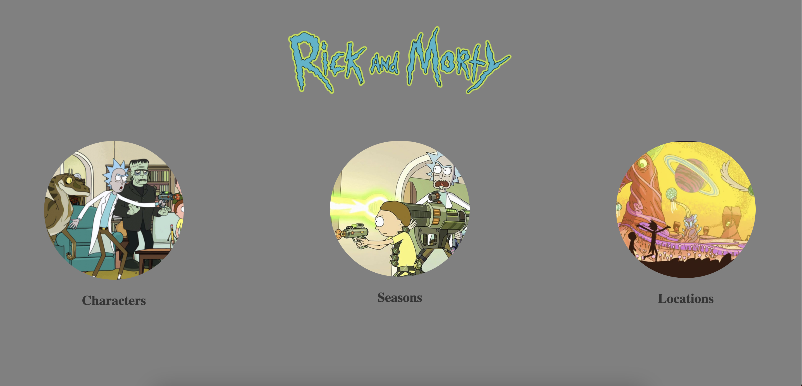

# Projeto Rick and Morty

### Projeto de estudo, criado utilizando a API: https://rickandmortyapi.com/

### Para visualizar acesse: https://prismatic-eclair-298973.netlify.app/

---

## Em progresso ⚠️

### Como rodar o projeto após clone:

- `yarn`
- `yarn start`

---

### Tecnologias utilizadas:

- ReactJs
- Typescript
- Material Ui
- Styled Components

---

